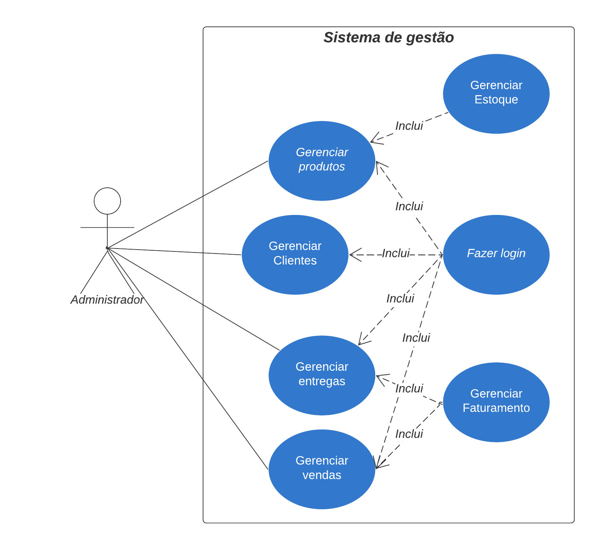

# Pele Dourada

## Documento de Arquitetura

Equipe Sagittarius

Tabela 1 – Histórico de Revisão

| Data | Versão | Descrição | Autor(es) |
| -- | -- | -- | -- |
| 16/12/2024 | 1.0 | Redação inicial do documento de arquitetura. | Equipe Sagittarius |
| 16/12/2024 | 1.0 | Tópicos 1.1 e 1.2. | Vilmar Fagundes |
| 16/12/2024 | 1.0 | Tópicos 2.3 e Diagrama de casos de uso. | Matheus de Alcântara |
| 16/12/2024 | 1.0 | Tópicos 2.4 e 2.8. | Fábio Santos Araújo |
| 16/12/2024 | 1.0 | Tópico 2.1, 2.2 e diagrama de classes. | Caio Lucas e Gabriel Flores |
| 16/12/2024 | 1.0 | Tópico 2.5. | Gabriel Flores |
| 17/12/2024 | 1.0 | Tópico 2.6. | Lucas Borges e André Gustavo |
| 17/12/2024 | 1.0 | Tópico 2.7. | Matheus de Alcântara e JoãoVictor Pires |
| 17/12/2024 | 1.0 | Tópico 2.9. | João Victor Pires |

Tabela 2 – Autores

| Matrícula | Nome | Descrição do papel assumido | % de contribuição |
| -- | -- | -- | -- |
| 231026509 | Matheus de Alcântara | Desenvolvedor Backend | 10% |
| 231026358 | Gabriel Flores | Desenvolvedor Banco de Dados | 10% |
| 231026302 | Caio Lucas | Desenvolvedor Backend | 10% |
| 222022082 | Fábio Santos | Desenvolvedor Banco de Dados | 10% |
| 231026590 | Vilmar Fagundes | Desenvolvedor Banco de Dados | 10% |
| 231026400 | João V. Pires | Desenvolvevor Backend | 10% |
| 221007635 | André Gustavo | Desenvolvedor Frontend | 10% |
| 222015159 | Lucas Borges | Desenvolvedor Backend | 10% |
| 222006150 | Mikael Kauan | Desenvolvedor Frontend | 10% |
| 221008196 | João V. Silva | Desenvolvedor Frontend | 10% |

## 1 Introdução

### 1.1 Propósito

Este documento tem como propósito, descrever a arquitetura do sistema sendo desenvol vido pelo grupo Sagittarius, na disciplina de MDS – Métodos de Desenvolvimento de Software (2024.2), chamado Pele Dourada, com o intuito de fornecer uma visão do sistema para desen volvedores, testadores e demais interessados.

### 1.2 Escopo

O projeto Pele Dourada visa criar um sistema para a loja Frango Assado Pele Dourada ge renciar as vendas semanais e mensais, o controle de seus estoques e o gerenciamento de enco mendas. Após entrevistas com o cliente, foram identificadas as prioridades de funcionalidades fundamentais. A principal tarefa é criar um website que cumpre os requisitos.

Demais detalhes em relação ao escopo do projeto, se encontram no documento “Documento de visão - Sagittarius”.

## 2 Representação Arquitetural

### 2.1 Defnições

O sistema seguirá uma arquitetura monolítica.

### 2.2 Justifque sua escolha.

A escolha da arquitetura monolítica se dá por alguns fatores, que foram preponderantes na decisão:

- Simplicidade de desenvolvimento: A curva de aprendizado desse tipo de arquitetura émaior, facilitando com que a equipe se familiarize mais rápido com o código, que por sua vez, é centralizado, o que possibilita um entendimento mais simplificado.

- Custo de implementação: O custo de implementação é menor, pois não há necessidade de gerenciar múltiplos serviços, por ser considerado um projeto de baixa escala, além do processo de deploy ser menos propenso a problemas.

- Testes e debugging: O rastreamento de erros é mais rápido pelo fato da aplicação ser centralizada, e os testes são mais simples, por conta de os módulos estarem no mesmo lugar.

- Desempenho: Por se tratar de uma apliacação de baixa escala, a arquitetura monolítica fornece uma menor sobrecarga de rede, juntamente com um processamento direto, fa zendo assim com que o desempenho seja otimizado.

### 2.3 Detalhamento

A escolha da arquitetura monolítica foi realizada para assegurar as vantagens previamente citadas no item 2.2 deste documento, uma vez que o sistema de baixa escala não exige uma separação completa de cada módulo do software. A centralização das camadas em uma mesma base de código facilita seu desenvolvimento e comunicação.

A camada de interface do usuário possui todas as funcionalidades a serem realizadas pelo cliente, onde é possível realizar login, cadastrar produtos, vendas, entregas, clientes e gerenciar o seu fluxo de caixa e estoque no prazo determinado. Ela recebe todas as interações do usuário como cliques e preenchimento de formulários para determinar as ações da camada de negócios.

A camada de negócios possui funções que operam juntamente com a camada de dados para garantir que o sistema funcione da maneira correta. É dentro desta camada que são realizadas

as atualizações do sistema de acordo com as requisições da interface e realizam a apresentação correta dos dados em tempo real, esta camada comunica-se diretamente com o banco de dados e faz as consultas das suas entidades.

A camada de banco de dados armazena todos os dados necessários para o funcionamento do sistema. Esta camada gerencia a leitura e escrita de dados, garantindo que a informação seja armazena de forma segura e eficiente.

Portanto, a figura abaixo demonstra o funcionamento da arquitetura monolítica, definida na seção 2.1 deste documento. É possível visualizar separadamente as camadas e como elas comunicam entre si.

    
    
Figura 1 – Representação da Arquitetura do Sistema

### 2.4 Metas e restrições arquiteturais

- Escalabilidade: O sistema deve ser escalável para acomodar o aumento continuo do vo lume de dados gerados pela equipe. Sendo fundamental garantir que a infraestrutura su porte esse crescimento ao longo do tempo sem comprometer o desempenho.

- Desempenho: O software deve oferecer tempos de resposta rápidos e desempenho efici ente, proporcionando uma experiência satisfatória para os usuários.

- Sustentação técnica: A arquitetura do software deve facilitar a manutenção e evolução do sistema ao longo do tempo, permitindo a implementação de novas funcionalidades,correções de bugs e melhorias contínuas de maneira eficiente.

- Segurança: É fundamental proteger o sistema contra acessos não autorizados, garantindo a integridade e confidencialidade dos dados.

Para definir as restrições arquiteturais do software de divulgação e gerenciamento, conside rar os seguintes entendimentos:

- Compatibilidade: O sistema deve ser compatível com todas as máquinas utilizadas pela equipe.

Essas metas e restrições arquiteturais devem ser cuidadosamente avaliadas e incorporadas ao processo de desenvolvimento, garantindo que o software atenda às necessidades da equipe e opere de forma eficiente e segura.

### 2.5 Visão de Casos de uso (escopo do produto)

O projeto Pele Dourada tem como objetivo desenvolver um sistema para a empresa Frango Assado Pele Dourada, para atender às suas necessidades de gerenciamento. A partir de entrevis tas com o cliente e um processo de levantamento de requisitos, foram identificadas as principais funcionalidades que compõem o escopo do produto.

As principais tarefas incluem a criação de um site para o gerenciamento interno da empresa.Para isso, o software deve ter gestão de estoque diário, vendas e encomendas, controle de caixa,cadastro de usuários, dashboard geral e autenticação de usuário.

Os cenários funcionais ajudam o time a estabelecer marcos de desenvolvimento para a cri ação de sprints, de modo que deixe claro para a equipe quais funcionalidades devem ser imple mentadas e a ordem de prioridade.

Na figura 2, ilustrada abaixo, são apresentados os casos de uso com os quais o ator principal,o administrador, pode interagir e como a aplicação funciona.

    
    
Figura 2 - Casos de uso

O ator principal, administrador, por meio da aplicação, após fazer o login, poderá fazer o gerenciamento do estoque, das vendas no balcão e encomendas, além de poder cadastrar clientes,com o intuito de facilitar a entrega de encomendas, e obter um resumo geral do faturamento da empresa.

O sistema será de uso interno e terá apenas um usuário, o qual será o administrador, esse fato colaborou para a escolha da arquitetura monolítica com banco de dados externo para acesso dos dados em máquinas diferentes. A arquitetura escolhida facilitará o desenvolvimento e a entrega dos requisitos elicitados pelo cliente.

### 2.6 Visão lógica

O sistema é composto de um único módulo:

- Módulo de gerenciamento: após o login do usuário no sistema, permite que este tenha acesso às informações gerais do dashboard, aos sistemas de gerenciamento de vendas e encomendas, de clientes e estoque.

– Dashboard: apresenta uma visão geral do desempenho mensal/semanal/diário de vendas e encomendas.

– Vendas e encomenda: possibilita o cadastro a modificação e a exclusão das vendas e encomendas realizadas.

– Clientes: permite o cadastro (incluindo informações como telefone e endereço), mo dificação e exclusão de clientes.

– Estoque: fornece a função tanto de cadastro de novos produtos no sistema, bem como a adição destes no estoque, determinando a quantidade escolhido pelo usuário para um determinado dia.

Os componentes do sistema interagem por meio de interfaces bem definidas, garantindo uma troca de informações consistente e eficiente. Detalhes adicionais podem ser encontrados no pro tótipo de alta fidelidade, disponível no Figma e armazenado no repositório ”2024.2-Sagittarius”na pasta docs e também ilustrado no diagrama de estados.

A seguir, na Figura 3, temos ilustrado o diagrama de estados da aplicação, que é aplicado para demonstrar o comportamento geral do sistema, mostrando os estados e transições do funci onamento do projeto. Sendo assim, é possível entender o comportamento do sistema conforme ele é utilizado, com suas principais transições.

Figura 3 – Diagrama de estados da aplicação

Além disso, para demais detalhes de como a aplicação funciona, inclui o diagrama de ati vidades do projeto, apresentado na Figura 4, que é aplicado para descrever as etapas realizadas conforme o usuário usa o sistema, deixando o funcionamento do mesmo mais claro. Sendo assim, no diagrama abaixo, é possível ver o que acontece em cada possibilidade conforme a utilização do site:

<!-- 10000  -->

Figura 4 – Diagrama de atividades da aplicação

Nele, também temos detalhadas as possíveis telas que participam da navegação do site, como proposto protótipo de alta fidelidade, disponível no Github e também no link a seguir: Figma.

Figura 5 – Diagrama de classes

O diagrama de classes para o gerenciamento da empresa Frango Assado Pele Dourada foi projetado para organizar e otimizar o controle de diversos aspectos envolvidos na administração da empresa. Este sistema compreende seis classes principais, cada uma com responsabilidades específicas que, em conjunto, contribuem para uma gestão eficiente e integrada.

### 2.7 Visão de Implementação

Os pacotes representam áreas funcionais distintas do sistema, promovendo organização, co esão interna e baixo acoplamento entre componentes. Essa estrutura modular facilita a adição de novos recursos e reduz os impactos causados por alterações específicas no código-fonte.

- Camada de Apresentação: desenvolvida com React, HTML, CSS e JavaScript, a camada de apresentação será responsável por fornecer uma interface interativa e responsiva. Ela permitirá aos usuários acessar funcionalidades como vendas, estoque, clientes e relatórios financeiros. A comunicação com o back-end será feita via requisições HTTP.

- Lógica de Negócios e Regras de Negócios: a lógica será implementada em Python usando o framework Django, que gerenciará as regras do sistema, como atualizações automáticas de estoque, geração de relatórios e controle de permissões. O Django seguirá o padrão MTV (Model-Template-View), garantindo modularidade e facilidade na manutenção.

- Comunicação com o Banco de Dados: o banco não relacional MongoDB será utilizado para armazenar dados em formato JSON-like. A integração com Django será feita pela biblioteca Djongo, permitindo consultas eficientes, validações e persistência dos dados relacionados a vendas, estoque, clientes e finanças.

Figura 6 – Diagrama de pacotes

### 2.8 Visão de Implantação

O software será implantado em um desktop configurado para atuar como servidor web, se guindo os padrões das aplicações modernas. Para o front-end, serão utilizadas as tecnologias React e JavaScript (BootStrap), que oferecem rapidez no desenvolvimento e alta qualidade na experiência do usuário. A estruturação das páginas será feita com HTML e a estilização com CSS.

No back-end, a linguagem Python foi escolhida devido à sua integração eficiente com a ar quitetura Monolito e à robustez do framework Django. O banco de dados será o MongoDB, que se destaca pela compatibilidade com JSON e atende bem ao projeto devido ao volume reduzido de dados esperado. Essa escolha garante integração eficiente com Python e flexibilidade no armazenamento.

Para o servidor, utilizaremos o Gunicorn, que promove agilidade e eficiência no processa mento de requisições, além de minimizar problemas de incompatibilidade entre as ferramentas utilizadas.

### 2.9 Restrições adicionais

Para garantir o funcionamento e a segurança dos dados algumas restrições relacionadas prin cipalmente as regras de negócio.

- O software deve ser acessível apenas para o administrador.

- O software exige login para o usuário.

- O software exige o cadastro de clientes para encomendas.

As seguintes características de qualidade serão mantidas durante todo projeto para garantir um bom desempenho e atender às expectativas do cliente.

- Usabilidade: O software deve possuir interface fácil de usar e funcionalidades fáceis de serem utilizadas.

- Confiabilidade: O sistema deve apresentar alta disponibilidade, garantindo que o usuário consiga acessá-lo quando desejar.

- Segurança: É fundamental garantir a proteção contra acessos não autorizados, preser vando a integridade dos dados e a privacidade das informações dos usuários.

## 3 Bibliografa

AJAX, Ricardo. Slides do professor Ricardo Ajax. 2024. Acesso em: 17 dez. 2024.

SERRANO, Milene. Material da Profa. Milene Serrano disponibilizado no Aprender 3. 2024.Acesso em: 17 dez. 2024.

Draw.io. Disponível em: https://app.diagrams.net/. Acesso em: 17 dez. 2024.

Lucidchart. Disponível em: https://lucid.app/. Acesso em: 16 dez. 2024.

